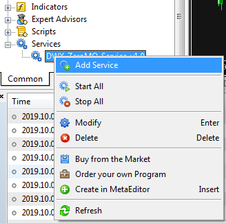
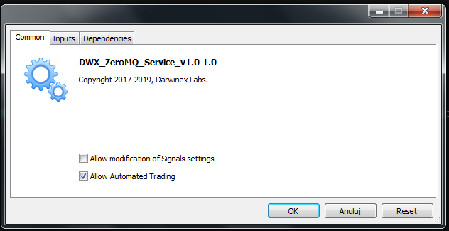
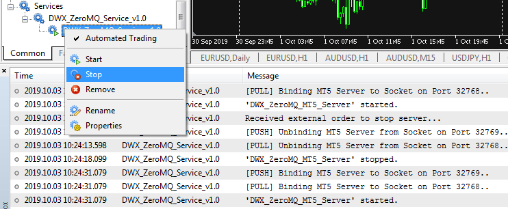
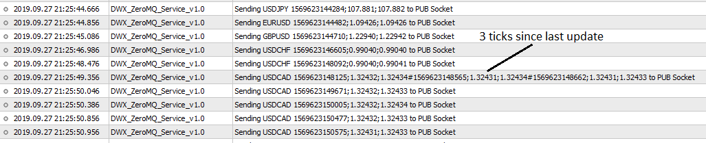

# DWX_ZeroMQ MT5 support
Here I would like to propose my version of MT5 support for DWX_ZeroMQ which consists of 3 different changes: using service instead of EA, suit main interface to better reflect mql5 trading activities and simplify message format communication. 
## Using service instead od EA
Implementing DWX_ZeroMQ_Service I used completely new approach because, instead of typical EA I chose new type of mql5 application called **Service**. Unlike scripts, EAs and indicators this kind of program does not need any chart and works in the background of the MT5 terminal. If added, such application is launched automatically when the terminal starts and does not conflict with any other service or EAs. Like script, service has only **OnStart** handler function.
Please follow these steps to check it out:
1. Place file to **MQL5/Services** folder:

   
1. Refresh terminal and from context menu choose **Add service**. 

   
1. Configure service like standard EA: **Allow Automated Trading**, etc. 

   
1. Manage the service using **Start**, **Stop** or **Remove** from the terminal. 

   
## Separating pending orders and opened positions
MQL5 algorithmic trading is much more complicated than MQL4 one. In the same time it gives much more possibilities. So I thought it is a good idea to prepare new trading interface and separate pending orders and working positions.
Also publishing new quotes data is much easier in MQL5. The service will not miss any new tick, even if there were more than one tick since last checking cycle:


I think that looking for compatibility with MQL4 could be difficult while developing the projekt and should not be considered.
## Simplification of request message format
My last proposal is to simplify communication 'protocol' for direction client->server by replacing 'TRADE|DATA' and 'ACTION' with predefined enum type. This would allow to replace inefficient stack of string comparsions with one string to number conversion.

Implementation of the service is based on code from *DWX_ZeroMQ_Server_v2.0.1_RC8.mq4* file. I tried to stick to the original coding style and modify as less as possible. All newly implemented conceptions should be enough well commented in the code.
To not mess up I created new python temporary files:
* **DWX_ZeroMQ_Connector_v1_0.py**
* **DWX_ZMQ_Execution_MT5.py**
* **DWX_ZMQ_Reporting_MT5.py**
* **DWX_ZMQ_Strategy_MT5.py**
* **coin_flip_traders_v1.0_MT5.py**

## Few examples

### Initialize and open new market position:
```
_zmq = DWX_ZeroMQ_Connector()
[INIT] Ready to send commands to METATRADER (PUSH): 32768
[INIT] Listening for responses from METATRADER (PULL): 32769
[INIT] Listening for market data from METATRADER (SUB): 32770

_my_trade = _zmq._generate_default_order_dict()

_my_trade['_action']=POS_OPEN

_zmq._DWX_MTX_NEW_TRADE_(_order=_my_trade)
Output: 
{'_action': 'EXECUTION', '_magic': 123456, '_ticket': 22955472,
'_open_time': '2019.10.03 15:37:16', '_open_price': 1.09599}
```

### Modify stop loss (20 pips) and remove take profit level:
```
_zmq._DWX_MTX_MODIFY_POSITION_BY_TICKET_(22955472,200,0)
Output: 
{'_action': 'POSITION_MODIFY', '_sl': 1.09399, '_tp': 0.0}
```

### Get list of positions and close all:
```
_zmq._DWX_MTX_GET_ALL_OPEN_POSITIONS_()
Output: 
{'_action': 'OPEN_POSITIONS', '_positions': {22955472: {'_magic': 123456, '_symbol': 'EURUSD',
'_lots': 0.01, '_type': 0, '_open_price': 1.09599, '_open_time': '2019.10.03 15:37:16',
'_SL': 1.09399, '_TP': 0.0, '_pnl': 0.17, '_comment': 'dwx-zeromq'}}}

_zmq._DWX_MTX_CLOSE_ALL_POSITIONS_()
Output: 
{'_action': 'CLOSE_ALL', '_responses': {22955472: {'_symbol': 'EURUSD', '_magic': 123456,
'_response': 'CLOSE_MARKET', 'response_value': 'Request completed', '_close_price': 1.09614,
'_close_lots': 0.01}}, '_response_value': 'SUCCESS'}
```

### Get some rates for H4:
```
_data_dict = _zmq._generate_default_data_dict()

_data_dict
Output: 
{'_action': 13,
 '_symbol': 'EURUSD',
 '_timeframe': 16385,
 '_start': '2018.12.20 17:00:00',
 '_end': '2018.12.23 17:00:00'}

_data_dict['_timeframe']=16388 # H4

_data_dict['_start']='2019.10.03 00:00:00'

_data_dict['_end']='2019.10.03 14:00:00'

_zmq._DWX_MTX_SEND_MARKETDATA_REQUEST_(**_data_dict)
Output: 
{'_action': 'GET_DATA', '_ohlc_data':
{'2019.10.03 00:00': [1.09591, 1.0965, 1.09586, 1.09605],
'2019.10.03 04:00': [1.09605, 1.09618, 1.0955, 1.09583],
'2019.10.03 08:00': [1.09584, 1.09738, 1.09411, 1.09635],
'2019.10.03 12:00': [1.09635, 1.09704, 1.0945, 1.09632]}}
```
### Get some ticks data:
```
_zmq._DWX_MTX_SEND_MARKET_TICKDATA_REQUEST_(_start='2019.10.03 16:15:00',_end='0')
Output: 
{'_action': 'GET_TICK_DATA', '_data':
{'2019.10.03 16:15:00.767': [1.09583, 1.09583], '2019.10.03 16:15:00.865': [1.09585, 1.09585],
'2019.10.03 16:15:01.064': [1.09584, 1.09584], '2019.10.03 16:15:02.124': [1.09585, 1.09585],
'2019.10.03 16:15:02.546': [1.09586, 1.09586], '2019.10.03 16:15:02.639': [1.09588, 1.09588],
'2019.10.03 16:15:11.781': [1.09589, 1.09589], '2019.10.03 16:15:12.164': [1.09588, 1.09588],
'2019.10.03 16:15:12.266': [1.09589, 1.09589], '2019.10.03 16:15:13.331': [1.09587, 1.09587],
'2019.10.03 16:15:13.743': [1.09586, 1.09586], '2019.10.03 16:15:15.238': [1.09587, 1.09587],
'2019.10.03 16:15:16.161': [1.09588, 1.09588], '2019.10.03 16:15:16.681': [1.09589, 1.09589],
'2019.10.03 16:15:16.762': [1.0959, 1.0959], '2019.10.03 16:15:18.096': [1.09589, 1.09589],
'2019.10.03 16:15:20.701': [1.0959, 1.0959], '2019.10.03 16:15:20.894': [1.09592, 1.09592],
'2019.10.03 16:15:26.597': [1.09591, 1.09591], '2019.10.03 16:15:27.647': [1.09592, 1.09592],
'2019.10.03 16:15:27.746': [1.09594, 1.09594], '2019.10.03 16:15:29.136': [1.09593, 1.09593],
'2019.10.03 16:15:29.310': [1.09594, 1.09594], '2019.10.03 16:15:30.343': [1.09593, 1.09593],
'2019.10.03 16:15:31.245': [1.09594, 1.09594], '2019.10.03 16:15:34.025': [1.09593, 1.09593],
'2019.10.03 16:15:39.409': [1.09592, 1.09592]}}
```
